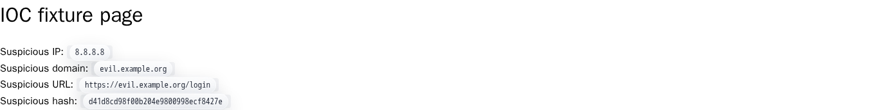
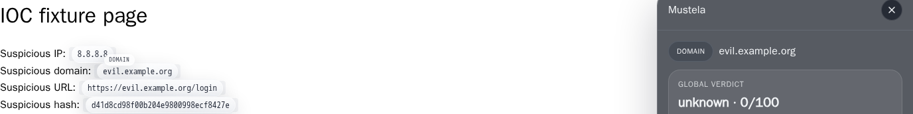
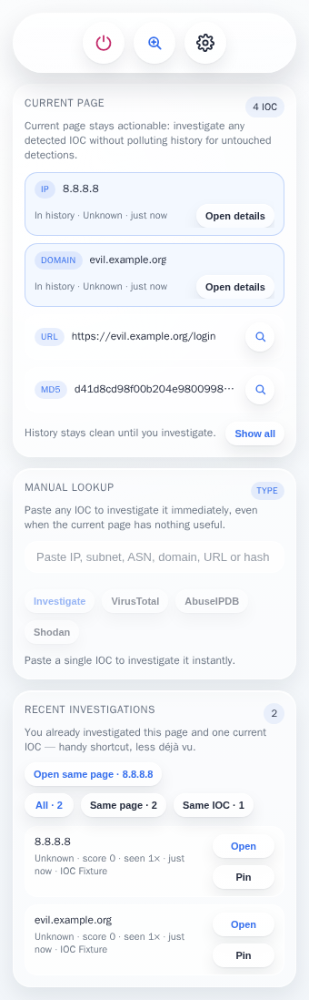

# Mustela

[](https://github.com/ArmorIntel/mustela/actions/workflows/ci.yml)
[](https://github.com/ArmorIntel/mustela/releases/latest)
[](LICENSE)
[](manifest/chrome.manifest.json)

**Mustela** is a Chrome extension for SOC analysts who want to investigate indicators of compromise (IOC) directly from the page they are already working on.

Instead of copying IPs, domains, URLs, and hashes across multiple tabs, Mustela highlights IOC on the page and gives you fast investigation actions in context.

> Named after *Mustela*, the weasel genus — small, fast, and very good at hunting.

## Why this exists

SOC workflows are full of repetitive pivots:

- copy an IOC from a SIEM, ticket, email, or CTI report
- open VirusTotal, AbuseIPDB, or Shodan
- paste the indicator
- correlate the result manually

Mustela reduces that friction and keeps the investigation loop inside the browser.

---

## Installation

### Option A — Download a pre-built release (recommended, no build tools needed)

1. Go to the [latest release](https://github.com/ArmorIntel/mustela/releases/latest)
2. Download the `mustela-vX.X.X-chrome.zip` file
3. Unzip it anywhere on your computer
4. Open **`chrome://extensions`** in Chrome
5. Enable **Developer mode** — toggle in the top-right corner

   

6. Click **Load unpacked** and select the folder you just unzipped
7. The Mustela icon appears in your toolbar — you are done

> **Tip:** Chrome may warn that the extension is from an unknown source. This is normal for extensions loaded outside the Chrome Web Store. The extension is open-source — you can inspect every line of code in this repository.

---

### Option B — One-liner (builds from source automatically)

If you have **Git** and **Node.js 18+** installed, run this in a terminal:

```bash
curl -fsSL https://raw.githubusercontent.com/ArmorIntel/mustela/main/install.sh | bash
```

The script clones the repo, installs dependencies, builds the extension, and prints the exact path to paste into Chrome's **Load unpacked** dialog.

---

### Option C — Manual build from source

```bash
git clone https://github.com/ArmorIntel/mustela.git
cd mustela
npm install
npm run build
```

Then load `dist/chrome` with **Load unpacked** in `chrome://extensions` (same steps 4–7 above).

---

## Setting up providers

Mustela detects and highlights IOC out of the box — no API keys required.

To get **enriched verdicts** (reputation scores, scan results, exposed-service data) inside the in-page panel, connect one or more free provider accounts.

### How to open the Options page

Right-click the Mustela icon in your toolbar → **Options**. Or go to `chrome://extensions`, find Mustela, and click **Details → Extension options**.

---

### VirusTotal

VirusTotal aggregates results from 70+ antivirus engines and provides reputation data for IPs, domains, URLs, and file hashes.

1. Create a free account at [virustotal.com](https://www.virustotal.com/gui/join-us)
2. Go to your [API key page](https://www.virustotal.com/gui/my-apikey)
3. Copy your **API Key**
4. Paste it into the **VirusTotal** field in Mustela's Options page

Free tier: 4 requests/minute, 500 requests/day. Sufficient for analyst workflows.

---

### AbuseIPDB

AbuseIPDB is a crowd-sourced database of reported malicious IP addresses.

1. Create a free account at [abuseipdb.com](https://www.abuseipdb.com/register)
2. Go to [Account → API](https://www.abuseipdb.com/account/api)
3. Click **Create Key**, give it a name, and copy the key
4. Paste it into the **AbuseIPDB** field in Mustela's Options page

Free tier: 1,000 requests/day. More than enough for daily analyst use.

---

### Shodan

Shodan scans the internet for exposed services and devices. Useful for enriching IP addresses with port, service, and banner data.

1. Create a free account at [shodan.io](https://account.shodan.io/register)
2. Log in and go to [My Account](https://account.shodan.io/)
3. Copy the **API Key** shown on the page
4. Paste it into the **Shodan** field in Mustela's Options page

Free tier: limited to basic queries (no historical data or filters). Covers standard IP lookups.

---

If a provider is not configured, Mustela remains fully functional for detection, highlighting, and external pivots — it just will not display enriched data for that provider.

---

## Setting up the LLM (Analyst Assist)

Mustela integrates a **large language model** to augment investigations with AI-powered analysis. This feature is **optional** — Mustela remains fully functional without it. When enabled, it provides:

- **Investigation summaries**: AI-generated one-sentence verdict and recommended next action for each IOC
- **Correlation analysis**: Identify patterns and relationships across multiple IOCs in your investigation history

The LLM runs on any **OpenAI-compatible API**, so you can use:

- **Anthropic Claude** (via [Anthropic API](https://console.anthropic.com/))
- **OpenAI** (GPT-4o, GPT-4 Turbo, etc.)
- **Local models** (Ollama, LM Studio, vLLM)
- Any other service with OpenAI `/chat/completions` compatible endpoints

### Configuring the LLM

1. Open the Mustela **Options** page (right-click the Mustela icon → **Options**)
2. Scroll down to the **Analyst Assist (LLM)** section
3. Check **Enable Analyst Assist**
4. Fill in:
   - **Base URL**: The API endpoint (e.g., `https://api.anthropic.com/v1` for Anthropic, `https://api.openai.com/v1` for OpenAI, `http://localhost:11434/v1` for Ollama)
   - **API Key**: Your API key from the service
   - **Model**: The model name (e.g., `claude-3-5-sonnet-20241022` for Claude, `gpt-4o` for OpenAI, `mistral` for Ollama)
5. Click **Save**

Mustela will validate the connection. If valid, the LLM features activate automatically.

### AI-powered Investigation Summary

When you investigate an IOC, the LLM automatically generates:

- **Summary**: A one-sentence assessment of what the score means in context
- **Action**: The single most important next investigative step

The LLM considers:
- The IOC type and value
- Verdicts from all your configured threat intelligence providers (VirusTotal, AbuseIPDB, Shodan)
- Whether providers disagree (and how to resolve the conflict)
- The page context where you found the IOC (SIEM, ticket, email, etc.)

**Example**: If investigating a domain on a ticket and VirusTotal flags it as malicious but Shodan finds it clean, the LLM might summarize: *"High-confidence malicious domain; flagged by multiple scanners, but recent benign hosting context suggests possible false positive — validate against your network logs."* The recommended action would be: *"Check your DNS logs for internal queries; if absent, mark as misdirection; if present, escalate for containment."*

### Cross-IOC Correlation Analysis

From the popup's **Analyze correlations** button, you can ask the LLM to identify patterns across your recent investigations:

- **Pattern detection**: Shared infrastructure, ASN clustering, similar threat profiles, potential campaign indicators, common contexts
- **Relationship verdict**: Are these IOCs "likely related", "possibly related", or "independent"?
- **Next investigative step**: The single best move given the patterns found

This is useful for:
- Identifying campaign activity across multiple alerts
- Clustering false positives or benign infrastructure
- Finding infrastructure reuse by known threat groups
- Connecting the dots across noisy SIEM output

**Example**: After investigating 5 IPs and 3 domains from a batch of alerts, the LLM identifies they all use the same ASN, share hosting with known phishing campaigns, and appear on the same infrastructure. The recommendation: *"High confidence these are coordinated infrastructure — check ASN reputation history; add all 8 indicators to your blocklist and correlate with known C2 sinkhole activity."*

### Recommended models

| Provider | Model | Tier | Good for Mustela? |
|---|---|---|---|
| **Anthropic** | `claude-3-5-sonnet-20241022` | Standard | ✅ Excellent — fast, cheap, low latency. Recommended. |
| **Anthropic** | `claude-3-opus-20250219` | Premium | ✅ Yes — more capable for complex correlations. Slower & more expensive. |
| **OpenAI** | `gpt-4o` | Standard | ✅ Good — comparable cost to Sonnet, reliable. |
| **OpenAI** | `gpt-4-turbo` | Premium | ✅ Yes — more capable, higher latency. |
| **Ollama** | `mistral` or `neural-chat` (local) | Free | ✅ Good — completely offline, no API costs. Slower on CPU. |
| **OpenAI** | `gpt-4 mini` | Budget | ⚠️ May struggle with complex correlations. |

**Default recommendation**: Start with **Claude 3.5 Sonnet**. It's the fastest and most cost-effective for this workload.

### Privacy with LLM

When enabled, the LLM receives:

- The IOC value and type (e.g., `192.168.1.1`, `domain`)
- Threat verdicts from your providers (e.g., `malicious`, `suspicious`, `clean`)
- The page context where you found it (URL, title)
- Your recent investigation history (for correlation analysis)

Assume the LLM provider will see this information. Mustela does **not**:
- Send your provider API keys to the LLM
- Send your full note history
- Send information about pages you've disabled highlighting on
- Store LLM responses; they are generated on-demand

If investigating highly sensitive indicators, disable the LLM or use a local model (Ollama).

---

## Features

### IOC detection

Mustela automatically detects the following indicator types on any page:

| Type | Examples |
|---|---|
| IPv4 address | `192.168.1.1`, `8.8.8.8` |
| IPv4 subnet | `10.0.0.0/8` |
| ASN | `AS15169` |
| Domain | `evil.example.com` |
| URL | `http://malware.example.com/payload` |
| MD5 hash | `d41d8cd98f00b204e9800998ecf8427e` |
| SHA1 hash | `da39a3ee5e6b4b0d3255bfef95601890afd80709` |
| SHA256 hash | `e3b0c44298fc1c149afb...` |

Detection runs locally in the browser — no data leaves your machine at this stage.

---

### Page highlighting

**IOC detected and highlighted directly on the page:**



Detected IOC are underlined with a color-coded marker directly on the page. The host page layout and behavior are not affected. You can disable highlighting per-page at any time using the **Disable on this page** toggle in the popup.

---

### In-page investigation panel

**One click on a highlight opens the investigation panel:**



Clicking any highlighted IOC opens a side panel anchored to the page. The panel shows:

- The IOC type and value
- Aggregated verdicts from all configured providers
- Quick-pivot links to open the IOC on each provider's site
- A local analyst note field (stored only in your browser)
- A JSON export of the full result

---

### Popup — manual lookup and history

**The popup summarizes the current page and keeps your recent investigations:**



Click the Mustela icon in the toolbar to:

- See a summary of all IOC detected on the current page, grouped by type
- Run a **manual lookup** of any IOC by pasting it into the search field
- Browse your **recent investigations** across all sessions
- Enable or disable Mustela on the current page

---

### Context-menu lookup

Select any text on a page, right-click, and choose **Investigate with Mustela**. Mustela recognises the IOC type automatically and opens the panel with results.

---

### Local storage — no backend

All data stays in your browser:

| Data | Stored in |
|---|---|
| API keys | `chrome.storage.local` |
| Lookup cache | `chrome.storage.local` |
| Investigation history | `chrome.storage.local` |
| Analyst notes | `chrome.storage.local` |
| Disabled-page rules | `chrome.storage.local` |

Nothing is sent to any backend. The only outbound calls are the provider lookups you explicitly trigger — and only toward the providers you configured. Full details in [`docs/PRIVACY_TRANSPARENCY.md`](docs/PRIVACY_TRANSPARENCY.md).

---

## Usage walkthrough

1. Open any page containing indicators — a SIEM alert, a ticket, a CTI report, an email
2. Mustela detects and highlights IOC automatically (underlined on the page)
3. Click a highlighted IOC to open the investigation panel
4. Review the aggregated verdict from your configured providers
5. Add an analyst note if you want to keep context for later
6. Use the external pivot links only when you need deeper context on a provider's site
7. Export the result as JSON for your case management tool

For IOC that are not on a page, paste them directly into the popup's search field.

---

## Privacy and trust posture

Mustela is intentionally transparent:

- IOC detection and highlighting run **locally in the browser**
- Settings, cache, history, notes, and disabled-page rules are stored in `chrome.storage.local` — not synced to any cloud
- Configured provider lookups send the IOC to the enabled third-party provider **and only when you request it**
- There is **no backend, no telemetry, no analytics, no account system**

If you investigate sensitive IOC, assume the enabled provider will see that IOC. Full details in [`docs/PRIVACY_TRANSPARENCY.md`](docs/PRIVACY_TRANSPARENCY.md).

---

## FAQ

**Does Mustela work on all websites?**  
Yes — it injects into any page Chrome loads. You can disable it per-page via the popup toggle if it interferes with a specific site.

**Can I use it without any API keys?**  
Yes. Detection, highlighting, external pivots, and the context menu all work without keys. API keys are only needed for enriched in-panel verdicts.

**Are my API keys safe?**  
Keys are stored in `chrome.storage.local`, which is sandboxed to the extension and not accessible to web pages or other extensions. They are never sent anywhere except the respective provider's API endpoint.

**Does the extension slow down pages?**  
Detection runs once when the page loads and processes text already in the DOM. It does not continuously scan the page or make network requests in the background.

**What happens if a provider is down or rate-limited?**  
The panel shows a clear error state for that provider while still showing results from the others. The cache prevents redundant requests for the same IOC within the same session.

**Is Firefox supported?**  
Not yet. Mustela currently targets Chrome and Chromium-based browsers (Edge, Brave, Arc, etc.) with Manifest V3. Firefox support is on the roadmap.

**Can I use the LLM features without configuring an LLM?**  
Yes. All LLM features are optional. Without an LLM, Mustela still detects, highlights, and investigates IOC using your configured threat intelligence providers alone.

**Do I need to pay for the LLM?**  
It depends on which service you choose. Anthropic Claude, OpenAI, and other commercial LLM APIs charge per request (typically <$0.01 per investigation). If you prefer free, you can run Ollama locally on your machine with no API costs — it will be slower on CPU but completely offline.

**Can I use a different LLM (not OpenAI-compatible)?**  
Not yet. Mustela currently supports OpenAI-compatible APIs. If you want support for other LLM APIs (Anthropic's native API, Azure OpenAI, etc.), open an issue on GitHub.

**Does the LLM see my provider API keys?**  
No. The LLM only receives the verdicts and summaries from your providers — never the API keys themselves.

**Can I contribute?**  
Yes. Read [`CONTRIBUTING.md`](CONTRIBUTING.md) for conventions. Security reports go through [`SECURITY.md`](SECURITY.md) — please do not open public issues for vulnerabilities.

---

## Development

```bash
npm install          # install dev dependencies
npm test             # fast Node test suite (parsing, providers, storage, popup state)
npm run build        # build the extension into dist/chrome
npm run test:e2e     # Playwright end-to-end suite (requires a display)
npm run package      # build + create dist zip in artifacts/
```

See [`CONTRIBUTING.md`](CONTRIBUTING.md) for conventions and what a good PR looks like.

---

## Current status

Mustela is a **Chrome MVP**. Firefox support, backend services, shared team memory, and advanced automation are not implemented and not claimed. Near-term priorities: stronger detection quality, fewer false positives, better investigation UX, and more robust provider handling.

Issues and feedback are welcome — especially from people who work in SOC operations, CTI, incident response, or threat hunting. If you test Mustela on real analyst workflows, that feedback is more valuable than theoretical architecture debates.

---

## License

[MIT](LICENSE)
